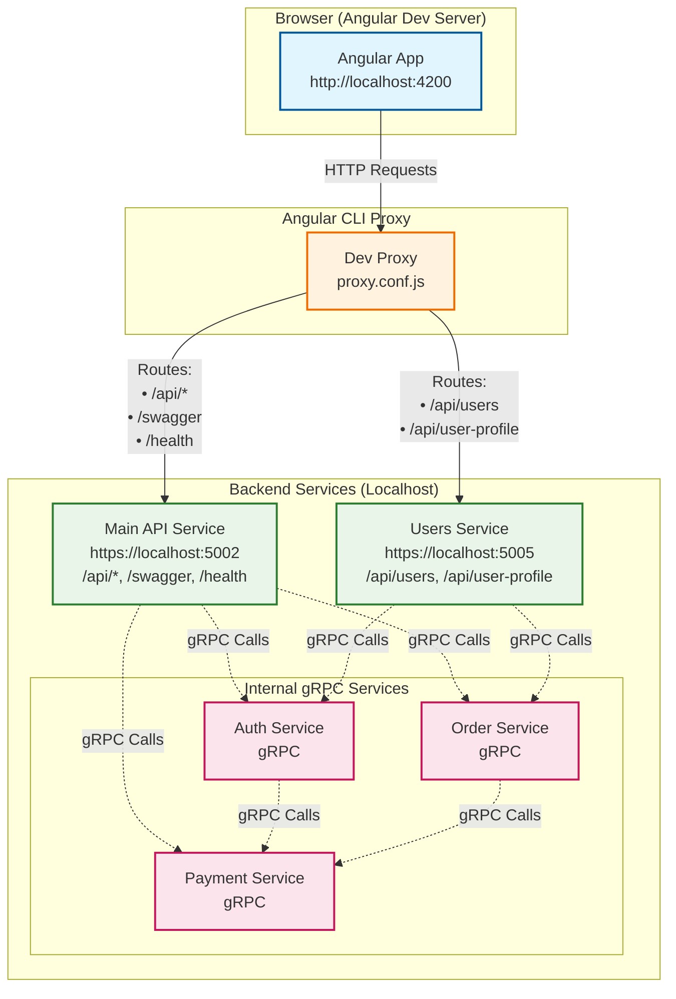

```mermaid
graph TB
    %% Клиентская часть
    subgraph "Browser (Angular Dev Server)"
        FE[Angular App<br/>http://localhost:4200]
    end

    %% Прокси разработки
    subgraph "Angular CLI Proxy"
        PROXY[Dev Proxy<br/>proxy.conf.js]
    end

    %% Бэкенд сервисы
    subgraph "Backend Services (Localhost)"
        GW[Main API Service<br/>https://localhost:5002<br/>/api/*, /swagger, /health]
        USERS[Users Service<br/>https://localhost:5005<br/>/api/users, /api/user-profile]
        
        %% Другие gRPC сервисы
        subgraph "Internal gRPC Services"
            SVC1[Auth Service<br/>gRPC]
            SVC2[Order Service<br/>gRPC]
            SVC3[Payment Service<br/>gRPC]
        end
    end

    %% Соединения Frontend
    FE -- "HTTP Requests" --> PROXY
    
    %% Прокси маршрутизация
    PROXY -- "Routes:<br/>• /api/users<br/>• /api/user-profile" --> USERS
    PROXY -- "Routes:<br/>• /api/*<br/>• /swagger<br/>• /health" --> GW
    
    %% gRPC взаимодействия между сервисами
    GW -.->|gRPC Calls| SVC1
    GW -.->|gRPC Calls| SVC2
    GW -.->|gRPC Calls| SVC3
    
    USERS -.->|gRPC Calls| SVC1
    USERS -.->|gRPC Calls| SVC2
    
    SVC1 -.->|gRPC Calls| SVC3
    SVC2 -.->|gRPC Calls| SVC3

    %% Легенда и стили
    classDef frontend fill:#e1f5fe,stroke:#01579b,stroke-width:2px
    classDef proxy fill:#fff3e0,stroke:#ef6c00,stroke-width:2px
    classDef httpService fill:#e8f5e8,stroke:#2e7d32,stroke-width:2px
    classDef grpcService fill:#fce4ec,stroke:#c2185b,stroke-width:2px
    
    class FE frontend
    class PROXY proxy
    class GW,USERS httpService
    class SVC1,SVC2,SVC3 grpcService
```