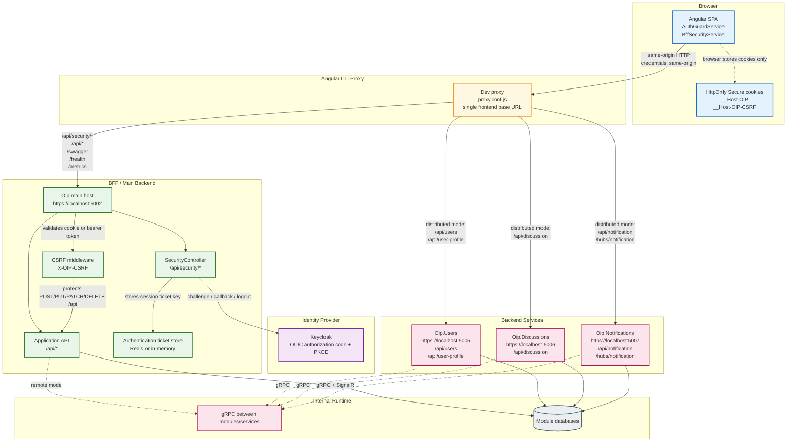

# Текущая схема приложения с BFF

Frontend работает с одним базовым URL и не хранит access/refresh token в браузере. Авторизационный код, обмен с Keycloak,
cookie-сессия, проверка прав и CSRF-защита находятся на backend-стороне.

## Основные потоки

- Вход: Angular вызывает `POST /api/security/create-auth-session`, backend запускает OIDC challenge в Keycloak и после
  успешного входа создает cookie-сессию.
- Проверка сессии: Angular вызывает `GET /api/security/get-current-auth-session` с cookie и получает только безопасные
  сведения о пользователе и ролях.
- Мутации API: сгенерированный `HttpClient` запрашивает CSRF-токен через
  `GET /api/security/get-auth-csrf-token` и отправляет его в заголовке `X-OIP-CSRF`.
- Выход: Angular отправляет POST-форму на `POST /api/security/delete-auth-session`, backend завершает cookie- и
  OpenID Connect-сессию.
- Совместимость: backend также поддерживает `Authorization: Bearer` для сценариев, где сервис вызывается напрямую или
  используется SignalR.
